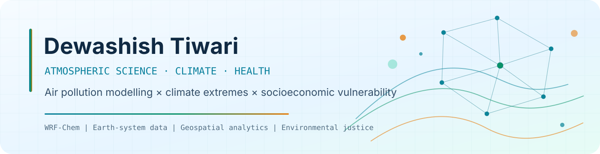
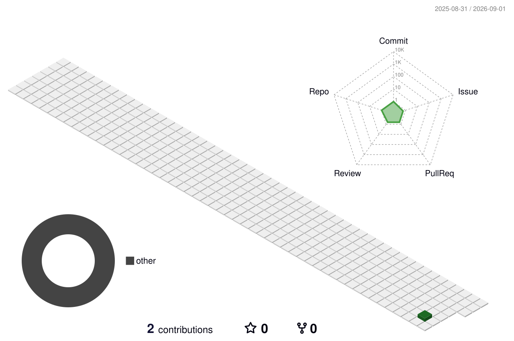

  <picture>
    <source media="(prefers-color-scheme: dark)" srcset="./assets/banner-dark.svg">
    <source media="(prefers-color-scheme: light)" srcset="./assets/banner-light.svg">
    
  </picture>

  

  
  
  
  

## Hello, I am Dewashish

I am a Ph.D. researcher at the **Indian Institute of Technology Bombay**, working where atmospheric science, climate change, air quality and environmental health meet.

My research combines coupled atmospheric modelling, climate-model experiments, satellite and ground observations, statistical inference and geospatial analytics. I use these tools to understand how aerosols affect extreme heat, who bears the largest pollution burden, and how scientific evidence can support cleaner and more equitable policy.

<table>
  <tr>
    <td><strong>Current base</strong> IIT Bombay, Mumbai, India</td>
    <td><strong>Research lens</strong> Atmosphere → exposure → health → equity</td>
    <td><strong>Collaboration mode</strong> Open to research and postdoctoral collaborations</td>
  </tr>
</table>

## Research operating system

<picture>
  <source media="(prefers-color-scheme: dark)" srcset="./assets/research-pipeline-dark.svg">
  <source media="(prefers-color-scheme: light)" srcset="./assets/research-pipeline-light.svg">
  
</picture>

| Research axis | Questions I work on | Main approaches |
|---|---|---|
| **Air-pollution modelling** | Which sources and sectors shape PM₂.₅ exposure across rural and urban India? | WRF-Chem, WRF, India-InMAP, emission inventories, source sensitivity |
| **Climate extremes** | How do aerosols influence dry heat, moist heat and compound extremes? | Climate-model experiments, reanalysis, event attribution, extreme-value analysis |
| **Air–climate interactions** | How do absorbing aerosols perturb radiation, meteorology and regional heat? | Aerosol-radiation diagnostics, ECHAM-HAM, satellite products, process analysis |
| **Health and environmental justice** | Who is exposed, who is vulnerable and where are risks concentrated? | Health-impact assessment, population exposure, rural–urban analysis, vulnerability mapping |
| **Reproducible Earth data science** | How can complex model output become transparent and decision-relevant? | Python, Xarray, geospatial analytics, uncertainty quantification, HPC |

## Current research

<table>
  <tr>
    <td width="50%"><h3>☀️ Aerosols × extreme heat</h3>Quantifying how absorbing aerosols modify temperature maxima, dry and moist heat stress, and heatwave persistence over India.</td>
    <td width="50%"><h3>🏘️ Rural–urban PM₂.₅ mortality</h3>Resolving sector-specific pollution and attributable mortality across rural and urban populations, with socioeconomic vulnerability.</td>
  </tr>
  <tr>
    <td width="50%"><h3>🧭 Compound climate–pollution risk</h3>Mapping where extreme heat and particulate pollution coincide, why these events form, and which populations face disproportionate risk.</td>
    <td width="50%"><h3>⚡ Fast policy assessment</h3>Supporting India-InMAP development with WRF-Chem inputs for rapid evaluation of emissions-control strategies and health benefits.</td>
  </tr>
</table>

## Models, data and tools

  
  
  
  
  
  
  
  
  
  
  

  
  
  
  
  
  

## Selected publications

1. **High risk from coincidence of extremes in particulate matter and heat in India.**  
   *Environmental Research Letters* 21, 074005 (2026).  
   

2. **Drivers of PM₂.₅ Episodes and Exceedance in India: A Synthesis From the COALESCE Network.**  
   *Journal of Geophysical Research: Atmospheres* 129 (2024).  
   

3. **Impact of boundary layer parameterizations on simulated seasonal meteorology over North-East India.**  
   *Dynamics of Atmospheres and Oceans* 108 (2024).  
   

<a href="https://scholar.google.com/citations?user=yhNojn8AAAAJ&hl=en&oi=ao">View all publications →</a>

## Research impact

> 🏆 **ACCESS Awards 2025 — Winner, Climate Mitigation and Finance**
>
> Co-developed **ACTIONN**, a scalable framework connecting clean-cooking transitions, carbon finance, rural entrepreneurship and climate-aligned livelihoods. The team received INR 400,000 in seed funding.

## Open-science roadmap

| Planned repository | What it will contain | Status |
|---|---|---|
| <code>wrfchem-india-toolkit</code> | Reusable WRF-Chem evaluation, diagnostics and visualization workflows | Preparing documentation |
| <code>compound-heat-pm25</code> | Reproducible spatial analysis of coincident heat and PM₂.₅ extremes | Research-to-code transition |
| <code>aerosol-climate-diagnostics</code> | Radiative forcing, temperature response and aerosol–heat diagnostics | Method consolidation |
| <code>pm25-health-equity</code> | District-level exposure, mortality and vulnerability workflows | Data-governance review |

## GitHub telemetry

  
  

  
<strong>Expanded research and coding metrics</strong>

   
  

## Contribution landscape

<picture>
  <source media="(prefers-color-scheme: dark)" srcset="./profile-3d-contrib/profile-night-rainbow.svg">
  <source media="(prefers-color-scheme: light)" srcset="./profile-3d-contrib/profile-season-animate.svg">
  
</picture>

<picture>
  <source media="(prefers-color-scheme: dark)" srcset="./assets/github-contribution-grid-snake-dark.svg">
  <source media="(prefers-color-scheme: light)" srcset="./assets/github-contribution-grid-snake.svg">
  
</picture>

## Let us collaborate

I am especially interested in collaborations involving:

- aerosol–radiation–meteorology interactions;
- WRF-Chem and reduced-complexity air-quality modelling;
- heatwaves, moist heat and compound extremes;
- PM₂.₅ exposure, attributable mortality and environmental justice;
- satellite–model–observation integration; and
- reproducible geospatial and Earth-system data science.

  <a href="mailto:dewashishtiwari07@gmail.com"><strong>Start a research conversation</strong></a>
  &nbsp;•&nbsp;
  <a href="https://www.linkedin.com/in/dewashish-tiwari-4903a4145/">LinkedIn</a>
  &nbsp;•&nbsp;
  <a href="https://scholar.google.com/citations?user=yhNojn8AAAAJ&hl=en&oi=ao">Google Scholar</a>

Science for cleaner air, a safer climate and healthier communities.

